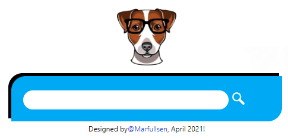

# optimarDB
Sistema de gestión de datos de una óptica.

## Descripción
El repo real del proyecto es privado, este repo se usa para repotar el avance final del proyecto.

## Estado del proyecto
El proyecto funciona perfecto de acuerdo a las necesidades del cliente.
